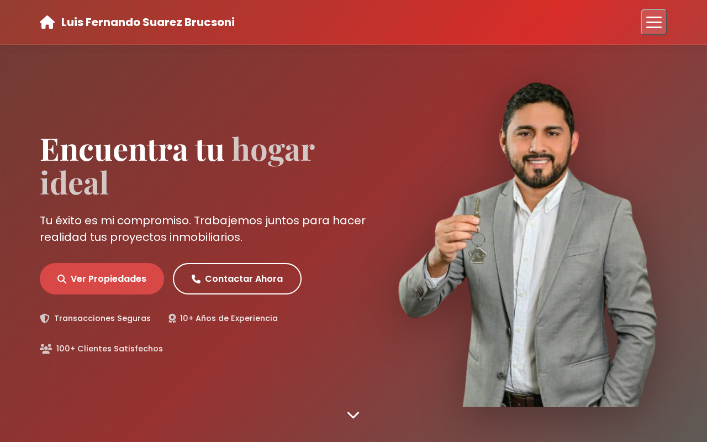
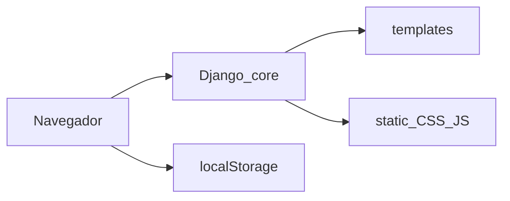

# Luis Fernando Suarez — Inmobiliaria

Sitio web del agente **Luis Fernando Suarez Brucsoni** (Bolivia): catálogo público (compra, venta, alquiler, anticrético) y zona de gestión de avisos. **Django 6** sirve plantillas; los inmuebles viven en el navegador (`localStorage`, clave `publications`) o en datos de ejemplo. Idioma `es-bo`, zona `America/La_Paz`.



**Estado:** sitio navegable; login/panel **no** usan `django.contrib.auth`. No hay modelos de inmuebles.

---

## El problema

Un agente necesita una vitrina en la web y un panel simple para publicar, sin montar un portal tipo marketplace.

---

## Qué se puede ver hoy

| URL | Qué hace |
|-----|----------|
| `/` | Inicio: hero, servicios, contacto |
| `/portafolio/` | Listado con filtros |
| `/inmueble/<id>/` | Ficha |
| `/iniciar-sesion/`, `/panel/`, `/publicacion/` | Acceso y alta/edición (demo) |
| `/admin/` | Admin de Django (sin modelos de negocio) |

---

## Cómo probarlo (2 minutos)

```bash
./run.sh
```

http://127.0.0.1:8000/ — o `docs/index.html` (prototipo estático antiguo).

---

## Qué hice yo

Proyecto Django (`core/`), plantillas, estáticos y panel en el cliente.

---

## Stack

Django ≥ 6, `< 7`. Vistas `TemplateView`. Estáticos en `static/` (producción: `collectstatic`).



---

## Instalación

```bash
python3 -m venv .venv
source .venv/bin/activate
pip install -r requirements.txt
python manage.py migrate
python manage.py runserver
```

Producción: [docs/PASOS_DJANGO.md](docs/PASOS_DJANGO.md).

Convenciones: ``, ``. Quedan algunos enlaces viejos tipo `/templates/index.html`.

```
manage.py, requirements.txt, run.sh
core/          # settings, urls, views
templates/     # HTML + navbar
static/        # CSS/JS por página
docs/          # Guía y prototipo estático
```

---

José Carlo Suárez Brucsoni · [joseca6520@gmail.com](mailto:joseca6520@gmail.com)

Uso personal y académico, salvo acuerdo distinto.
