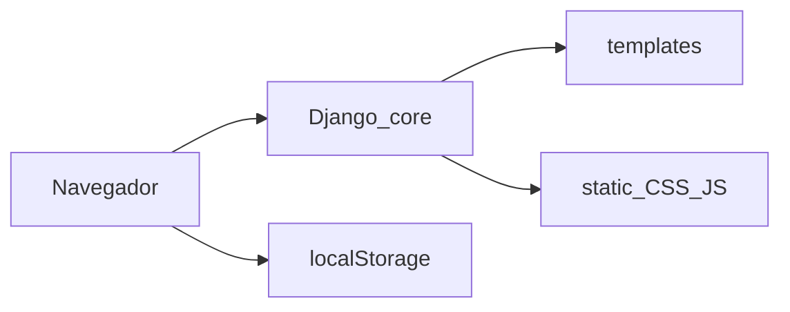

# Luis Fernando Suarez — Inmobiliaria

Sitio web personal de **Luis Fernando Suarez Brucsoni**, agente inmobiliario. El público puede ver propiedades (compra, venta, alquiler y anticrético), servicios y datos de contacto. Hay una zona de gestión para publicaciones (inicio de sesión, panel y alta/edición).

El proyecto está en **Django 6**. Las páginas son plantillas HTML servidas por vistas genéricas (`TemplateView`). No hay aplicaciones Django propias ni modelos de inmuebles: el listado y la ficha usan datos en el navegador (`localStorage`, clave `publications`) y, si no hay nada guardado, propiedades de ejemplo.

Idioma: `es-bo`. Zona horaria: `America/La_Paz`.

## Páginas

| URL | Plantilla | Qué hace |
|-----|-----------|----------|
| `/` | `templates/index.html` | Inicio: hero, servicios, contacto |
| `/portafolio/` | `templates/Portafolio.html` | Listado de propiedades con filtros |
| `/inmueble/<id>/` | `templates/Inmueble.html` | Ficha de una propiedad |
| `/iniciar-sesion/` | `templates/InicioDeSesion.html` | Acceso al panel |
| `/panel/` | `templates/Panel.html` | Dashboard y listado de publicaciones |
| `/publicacion/` | `templates/Publicacion.html` | Crear o editar una publicación |
| `/admin/` | Admin de Django | Administración del framework (aún sin modelos de negocio) |

Las rutas están en `core/urls.py`. Los enlaces internos deben usar ``, ``, etc.



## Cómo está conformado

```
.
├── manage.py              # Comandos Django
├── requirements.txt       # Django >= 6.0, < 7
├── run.sh                 # Crea .venv, instala deps y arranca el servidor
├── core/                  # Proyecto Django (no hay apps extra)
│   ├── settings.py
│   ├── urls.py
│   ├── views.py           # TemplateView + active_nav
│   ├── wsgi.py
│   └── asgi.py
├── templates/             # HTML
│   ├── index.html
│   ├── Portafolio.html
│   ├── Inmueble.html
│   ├── InicioDeSesion.html
│   ├── Panel.html
│   ├── Publicacion.html
│   └── components/
│       └── navbar.html
├── static/                # CSS y JS en desarrollo
│   ├── css/               # style, portafolio, inmueble, panel, publicacion
│   └── js/                # main, navbar, portafolio, inmueble, panel, publicacion
└── docs/                  # Guía de arranque y prototipo estático antiguo
    ├── PASOS_DJANGO.md
    └── index.html
```

- **`core/`** — configuración, URLs y vistas. Cada vista apunta a una plantilla y, en las páginas públicas, pasa `active_nav` para marcar el ítem del menú.
- **`templates/`** — markup. La barra de navegación compartida está en `templates/components/navbar.html`.
- **`static/`** — un CSS/JS principal por página (`style.css` / `main.js` en inicio; el resto con el mismo nombre de la pantalla) más `navbar.js`.
- **`docs/`** — no es la aplicación que se sirve. El sitio vivo es Django. Ahí está la guía larga de desarrollo y producción (`docs/PASOS_DJANGO.md`) y un HTML estático anterior.

En desarrollo Django sirve estáticos desde `static/` (`STATICFILES_DIRS`). En producción hay que usar `collectstatic` hacia `staticfiles/` (ver la guía en `docs/`).

## Arranque rápido

Opción A — script:

```bash
./run.sh
```

Crea `.venv` si no existe, instala dependencias y levanta el servidor.

Opción B — a mano:

```bash
python3 -m venv .venv
source .venv/bin/activate
pip install -r requirements.txt
python manage.py migrate
python manage.py runserver
```

El sitio queda en [http://127.0.0.1:8000/](http://127.0.0.1:8000/).

Pasos de producción (`DEBUG`, `ALLOWED_HOSTS`, `collectstatic`, superusuario): [docs/PASOS_DJANGO.md](docs/PASOS_DJANGO.md).

## Limitaciones actuales

- Los inmuebles **no** se guardan en SQLite. Viven en `localStorage` del navegador (y datos de ejemplo si está vacío).
- El formulario de inicio de sesión y el panel **no** usan `django.contrib.auth`. El admin de Django (`/admin/`) es independiente.
- Quedan algunos enlaces antiguos del estilo `/templates/index.html` (por ejemplo en el breadcrumb de la ficha). Las rutas correctas son las de la tabla de páginas.

## Convenciones

- En plantillas: `` para rutas y `` para CSS, JS e imágenes.
- Página nueva: ruta en `core/urls.py`, vista en `core/views.py`, HTML en `templates/` y, si hace falta, CSS/JS en `static/`.
